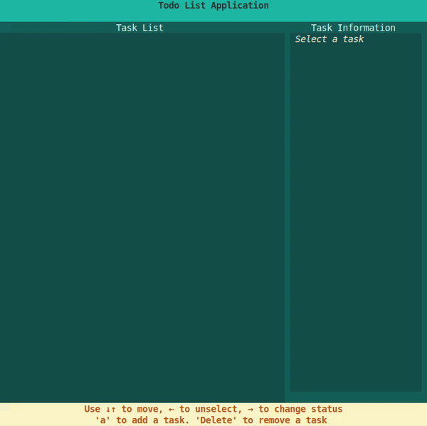
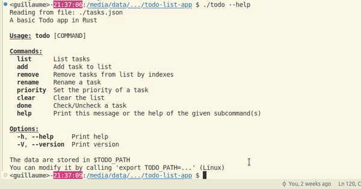

# Basic to-do app in Rust, using ratatui GUI

Basic to-do app with [ratatui](https://ratatui.rs/) to learn Rust and use crates

If you are learning Rust and you want to see a simplier implementation, I recommend that you look at the v1.0 version (check the "See Also" section at the bottom) 
This version implements command-line interaction using the clap crate.

## Demo

## Authors

- [@elevenJune](https://github.com/ElevenJune)

## Usage

`cargo run`

## Features

Creates a list of tasks and saves it to the $TODO_PATH environment variable.

If not defined, the tasks will be saved to ./tasks.json

Possible actions:
- Use arrows ↓↑ to select a task
- Use arrow  ← to unselect
- Add a task with "a"
- Modify the selected task with "Enter"
- -> Type to edit name
- -> Use +/- to edit priority
- Press "Enter" to save, or "Esc" to cancel changes
- Press → to change status (Done/To do)

## Crates used
- serde_json : serialization to json
- ratatui : GUI
- dialoguer : confirmation message in case the list has be erased
- thiserror : custom error
- color-eyre : error handling used by ratatui

## See Also
[Version without ratatui, using clap instead](https://github.com/ElevenJune/todo-app-rust/tree/v1.0)

You can switch to this version by executing 
`cd ./todo-list-app` 
`git checkout v1.0` 
`cargo run`

Demo: 

